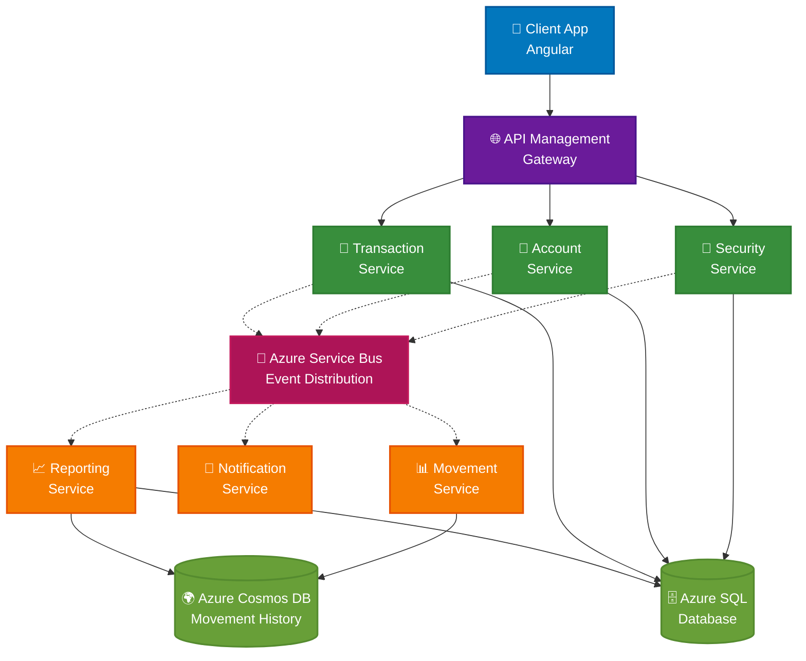

# Asset Management - Domain Mapping

Đây là bản đồ cấu trúc các thành phần cốt lõi trong tầng Domain và SharedKernel của dự án.

```text
src/
├── AssetManagement.SharedKernel/        <-- (Nền tảng: Dùng chung cho nhiều dự án sau này)
│   ├── Abstractions/                    
│   │   ├── Entity.cs                    <-- Base class cho các thực thể (Generic Id)
│   │   ├── AuditableEntity.cs           <-- Thực thể có lưu vết ngày tạo/sửa
│   │   ├── IAggregateRoot.cs            <-- Đánh dấu Root của một nhóm thực thể
│   │   ├── IDomainEvent.cs              <-- Interface cho các sự kiện nghiệp vụ
│   │   ├── IRepository.cs               <-- Chuẩn chung cho các kho lưu trữ
│   │   └── Result.cs                    <-- Thay thế Exception bằng Result Pattern
│   └── ValueObjects/                    <-- Các kiểu dữ liệu chuẩn hóa
│       ├── Email.cs
│       └── Money.cs
│
├── AssetManagement.Domain/              <-- (Nghiệp vụ: Trái tim của hệ thống)
│   ├── Assets/                          <-- (Nhóm: Quản lý Tài sản)
│   │   ├── Asset.cs                     <-- Entity chính (Aggregate Root)
│   │   ├── AssetType.cs                 <-- Loại (Laptop, Mobile...)
│   │   ├── AssetModel.cs                <-- Mẫu mã (Dell XPS 15...) - [Sắp tạo]
│   │   ├── AssetMaintenance.cs          <-- Lịch sử bảo trì/nâng cấp - [Sắp tạo]
│   │   ├── Manufacturer.cs              <-- Hãng sản xuất - [Sắp tạo]
│   │   ├── AssetErrors.cs               <-- Định nghĩa tập trung các lỗi nghiệp vụ
│   │   └── ValueObjects/                <-- Chỉ dùng riêng cho Asset
│   │       ├── SerialNumber.cs
│   │       ├── AssetTag.cs
│   │       └── Prefix.cs
│   │
│   ├── Companies/                       <-- (Nhóm: Tổ chức - [Sắp tạo])
│   │   ├── Company.cs                   <-- Công ty/Chi nhánh
│   │   └── ICompanyRepository.cs
│   │
│   ├── Departments/                     <-- (Nhóm: Phòng ban - [Sắp tạo])
│   │   ├── Department.cs                <-- Nơi quản lý biên chế tài sản
│   │   └── IDepartmentRepository.cs
│   │
│   ├── Locations/                       <-- (Nhóm: Vị trí - [Sắp tạo])
│   │   ├── Location.cs                  <-- Kho, Tòa nhà, Phòng họp
│   │   └── ILocationRepository.cs
│   │
│   ├── Shared/                          <-- (Value Objects dùng chung cho Domain)
│   │   ├── Name.cs                      <-- Định dạng tên chuẩn
│   │   └── Description.cs               <-- Định dạng mô tả chuẩn
│   │
│   └── Users/                           <-- (Nhóm: Nhân viên - [Sắp tạo])
│       ├── User.cs                      <-- Người sử dụng tài sản
│       └── IUserRepository.cs
```

