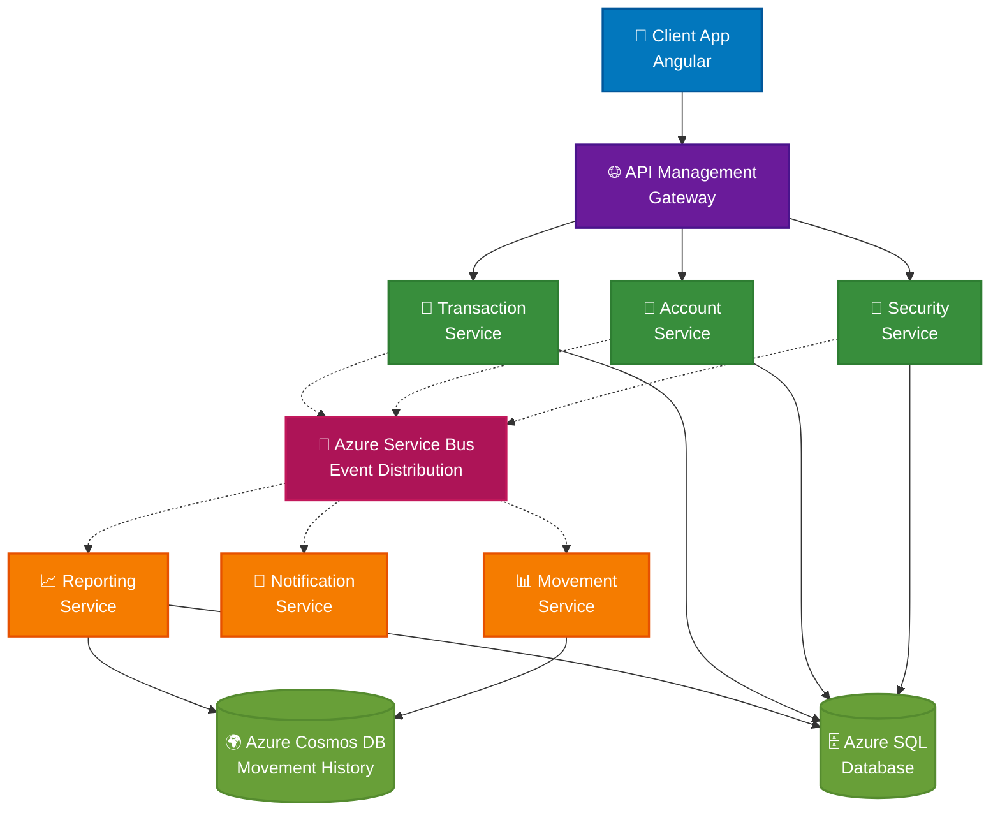

# Asset Management - Domain Mapping

Đây là bản đồ cấu trúc các thành phần cốt lõi trong tầng Domain và SharedKernel của dự án.

```text
src/
├── AssetManagement.SharedKernel/        <-- (Nền tảng: Dùng chung cho nhiều dự án sau này)
│   ├── Abstractions/
│   │   ├── Entity.cs                    <-- Base class cho các thực thể (Generic Id)
│   │   ├── AuditableEntity.cs           <-- Thực thể có lưu vết ngày tạo/sửa
│   │   ├── IAggregateRoot.cs            <-- Đánh dấu Root của một nhóm thực thể
│   │   ├── IDomainEvent.cs              <-- Interface cho các sự kiện nghiệp vụ
│   │   ├── IRepository.cs               <-- Chuẩn chung cho các kho lưu trữ
│   │   └── Result.cs                    <-- Thay thế Exception bằng Result Pattern
│   └── ValueObjects/                    <-- Các kiểu dữ liệu chuẩn hóa
│       ├── Email.cs
│       └── Money.cs
│
├── AssetManagement.Domain/              <-- (Nghiệp vụ: Trái tim của hệ thống)
│   ├── Assets/                          <-- (Nhóm: Quản lý Tài sản)
│   │   ├── Asset.cs                     <-- Entity chính (Aggregate Root)
│   │   ├── AssetType.cs                 <-- Loại (Laptop, Mobile...)
│   │   ├── AssetModel.cs                <-- Mẫu mã (Dell XPS 15...) - [Sắp tạo]
│   │   ├── AssetMaintenance.cs          <-- Lịch sử bảo trì/nâng cấp - [Sắp tạo]
│   │   ├── Manufacturer.cs              <-- Hãng sản xuất - [Sắp tạo]
│   │   ├── AssetErrors.cs               <-- Định nghĩa tập trung các lỗi nghiệp vụ
│   │   └── ValueObjects/                <-- Chỉ dùng riêng cho Asset
│   │       ├── SerialNumber.cs
│   │       ├── AssetTag.cs
│   │       └── Prefix.cs
│   │
│   ├── Companies/                       <-- (Nhóm: Tổ chức - [Sắp tạo])
│   │   ├── Company.cs                   <-- Công ty/Chi nhánh
│   │   └── ICompanyRepository.cs
│   │
│   ├── Departments/                     <-- (Nhóm: Phòng ban - [Sắp tạo])
│   │   ├── Department.cs                <-- Nơi quản lý biên chế tài sản
│   │   └── IDepartmentRepository.cs
│   │
│   ├── Locations/                       <-- (Nhóm: Vị trí - [Sắp tạo])
│   │   ├── Location.cs                  <-- Kho, Tòa nhà, Phòng họp
│   │   └── ILocationRepository.cs
│   │
│   ├── Shared/                          <-- (Value Objects dùng chung cho Domain)
│   │   ├── Name.cs                      <-- Định dạng tên chuẩn
│   │   └── Description.cs               <-- Định dạng mô tả chuẩn
│   │
│   └── Users/                           <-- (Nhóm: Nhân viên - [Sắp tạo])
│       ├── User.cs                      <-- Người sử dụng tài sản
│       └── IUserRepository.cs
```

```mermaid
graph TB
    %% Client Layer
    Client[📱 Client App<br/>Angular]

    %% Gateway Layer
    Gateway[🌐 API Management<br/>Gateway]

    %% Core Services Layer
    Security[🔐 Security<br/>Service]
    Account[🏦 Account<br/>Service]
    Transaction[💸 Transaction<br/>Service]

    %% Event Bus
    ServiceBus[🚌 Azure Service Bus<br/>Event Distribution]

    %% Read Services Layer
    Movement[📊 Movement<br/>Service]
    Notification[🔔 Notification<br/>Service]
    Reporting[📈 Reporting<br/>Service]

    %% Data Layer
    SqlDB[(🗄️ Azure SQL<br/>Database)]
    CosmosDB[(🌍 Azure Cosmos DB<br/>Movement History)]

    %% Client to Gateway
    Client --> Gateway

    %% Gateway to Core Services
    Gateway --> Security
    Gateway --> Account
    Gateway --> Transaction

    %% Core Services to Event Bus
    Security -.-> ServiceBus
    Account -.-> ServiceBus
    Transaction -.-> ServiceBus

    %% Event Bus to Read Services
    ServiceBus -.-> Movement
    ServiceBus -.-> Notification
    ServiceBus -.-> Reporting

    %% Data Connections
    Security --> SqlDB
    Account --> SqlDB
    Transaction --> SqlDB
    Movement --> CosmosDB
    Reporting --> SqlDB
    Reporting --> CosmosDB

    %% Styling - Darker backgrounds with white text for optimal contrast
    classDef clientStyle fill:#0277bd,stroke:#01579b,stroke-width:2px,color:#ffffff
    classDef gatewayStyle fill:#6a1b9a,stroke:#4a148c,stroke-width:2px,color:#ffffff
    classDef coreServiceStyle fill:#388e3c,stroke:#2e7d32,stroke-width:2px,color:#ffffff
    classDef readServiceStyle fill:#f57c00,stroke:#e65100,stroke-width:2px,color:#ffffff
    classDef eventStyle fill:#ad1457,stroke:#c2185b,stroke-width:2px,color:#ffffff
    classDef dataStyle fill:#689f38,stroke:#558b2f,stroke-width:2px,color:#ffffff

    class Client clientStyle
    class Gateway gatewayStyle
    class Security,Account,Transaction coreServiceStyle
    class Movement,Notification,Reporting readServiceStyle
    class ServiceBus eventStyle
    class SqlDB,CosmosDB dataStyle
```

```cs
users [icon: user, color: blue] {
id Guid pk
employeeId string
email string
phoneNumber int
IEnumerble<Asset> AssetId Guid
usePC bool
loginEnable bool
}

asset [icon: computer, color: blue] {
id Guid pk
note? string
status enum

assetName string AutoCreate if null
serialNumber string AutoCreate if null

assignedUserId Guid
companyId Guid
modelId Guid [manufacturerId, categoryId]
orderInformationId Guid

defaultLocationId Guid
locationId Guid

createdAt datetime
createdByUserId Guid
updatedAt datetime
updatedByUserId Guid
checkoutAt datetime
checkoutByUserId Guid
deletedAt datetime
deletedByUserId Guid
}

supplier {
id Guid
name string
contactInformation string
purchaseLocationId Guid
serviceCenterLocationId Guid
}

orderInformation {
id Guid
orderNumber string
purchaseDate string
purchaseCost Money
supplierId Guid
}

assetModel [icon: home] {
id Guid pk
name string
note string
modelNo string
image string

manufacturerId Guid
categoryId Guid
fieldSetId Guid

createdAt datetime
createByUserId Guid
updatedAt datetime
updatedByUserId Guid
deletedAt datetime
deletedByUserId Guid
}

manufacturer [icon: folder] {
id Guid
name string
urlHomePage string
image string
}

category [icon: message-circle, color: green] {
id Guid
name string
assetType enum
}

fieldSet [icon: mail, color: green] {
id Guid
name string
IEnumberble<FieldItem> FieldItem Guid
}

customField {
id Guid
name string
element string
format string
}

fieldItem {
id Guid
fieldSetId Guid
customFieldId Guid
Order int
}

users.teams <> teams.id
workspaces.folderId > folders.id
workspaces.teamId > teams.id
chat.workspaceId > workspaces.id
invite.workspaceId > workspaces.id
invite.inviterId > users.id
```
